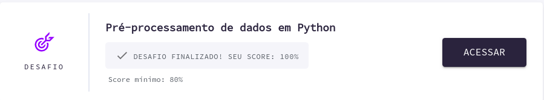
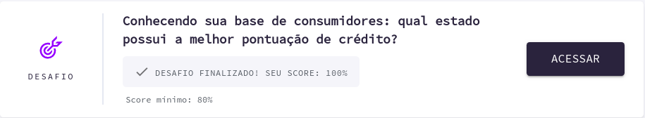
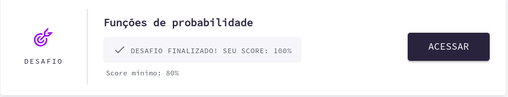
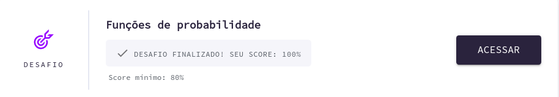
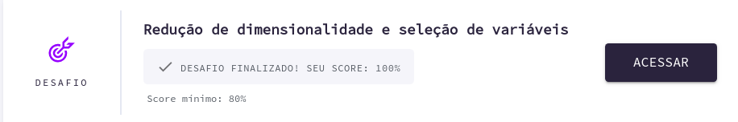
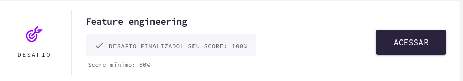
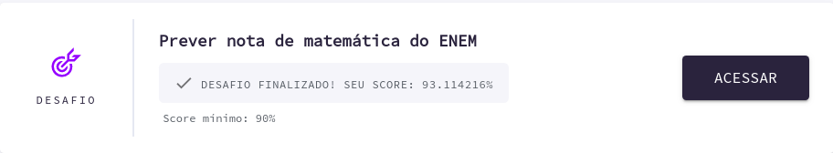

</img>
<h1 align="center">AceleraDev Data Science</h1>

Projetos de <strong>Data Science</strong> desenvolvidos durante o curso AceleraDev Data Science - Codenation

  <a aria-label="Versão do Python" href="https://www.python.org/downloads/release/python-376/">
    </img>
  </a>
  <a aria-label="Desafios" href="DESAFIOS.md">
  	</img>
  </a>
  <a aria-label="Completo" href="https://www.codenation.dev/">
    </img>
  </a>

## Sobre o curso
O Programa Aceleradev Data Science da Codenation é um curso de 10 semanas, onde ao final de cada uma é liberado um novo módulo com video-aulas, material teórico e desafios. 

## Emenda do curso:

- Semana 1: Introdução a Ciência de Dados
- Semana 2: Pré-processamento de Dados em Python
- Semana 3: Análise de dados exploratória
- Semana 4: Continuação Análise de dados exploratória
- Semana 5: Pensamento estatístico em Python
- Semana 6: Continuação Pensamento estatístico em Python
- Semana 7: Engenharia de Features
- Semana 8: Regressão
- Semana 9: Classificação

## Semana 1 - Quiz
A primeira semana de curso foi bem introdutória, foi apresentado conceitos iniciais da ciência de dados e quais são as skills do profissional dessa área.Além disso, foi estudado os tipos de soluções de aprendizado: Solução Descritiva, Solução Diagnóstica, solução Preditiva e Solução Prescritiva. Os tipos de aprendizados (supervisionado e não-supervisionado) e problemas (Classificação Binária, Classificação multiclasse, Regressão, Clusterização, Sistemas de Recomendação) atacados pelo cientista de dados também foram discutidos. Ao final, foi respondido um quiz com 15 questões sobre data Science onde obtive 80% de acerto.

</img>

## Semana 2 - Desafio0

Na segunda semana foi apresentado o famoso pandas(biblioteca de manipulação de dados) que em aulas práticas aprendi boa parte de seus metodos e funções incríveis. Nas últimas aulas foi exposto um conteúdo muito interessante sobre o framework streamlit(ferramenta de vizualização interativa com dados), onde criei uma aplicação para exploração de datasets.csv. Por fim, foi realizado um desafio onde obtive 100% de acerto.

</img>

Veja em [Desafio0/README.md](./Desafio0) para informações sobre o desafio0.

## Semana 3 - Desafio1

Cientista de dados precisa estudar estatatísca? Sim, Yes, Si, Ja, Hai. Na semana 3 iniciamos os estudados em EDA(análise exploratória de dados) apoiando-se em muita estatística, portanto foi assimilado conceitos como estatística descritiva univariada(média, moda, mediana, quartis, percentis, amplitude interquartil, desvio padrão, variância, assimetria, curtose) e estatistíca descritiva multivariada(correlação de spearman, correlação pearson). Também, foi praticado técnicas de vizualizações de dados com bibliotecas como matplotlib e seaborn, onde foi estudado diferentes tipos de gráficos como: histograma, box-plot, scatter-plot e  matriz de correlação. Por fim, foi realizado um desafio onde obtive 100% de acerto.
 
</img>

Veja em [Desafio1/README.md](./Desafio1) para informações sobre o desafio1.

## Semana 4 - Desafio2

Na quarta semana estudamos conceitos como população, amostra, amostragem.Além disso, os tipos de amostragem divididos em aleatória, não aleatória e estratificada(proporcional e uniforme) e os problemas de amostragem(undercoverage bias, self-selection bias,health-users biais, survivor bias) foram conceitos discutidos.
Aprendi sobre os tipos de distribuição de dados(distribuição normal, distribuição binomial) e funções de probabilidade(
função densidade de probabilidade(pdf), função distribuida acumulada(cdf) e função distribuida acumulada empirica (ecdf))
 Por fim, foi realizado um desafio onde obtive 100% de acerto.

</img>

Veja em [Desafio2/README.md](./Desafio2) para informações sobre o desafio1.

## Semana 5 - Desafio3

Na quinta semana foi apresentado o teorema do limite central e o conceito de p-valor e como interpreta-lo, assim como focamos em vários testes estatísticos, detalhando e realizando exercicios sobre cada um. Alguns testes introduzidos na semana foram: student t-test, shapiro-wick e jarque bera. Por fim, foi realizado um desafio onde obtive 100% de acerto.

</img>

Veja em [Desafio3/README.md](./Desafio3) para informações sobre o desafio3.

## Semana 6 - Desafio4

Na sexta semana foi estudado afundo o problema de dimensionalidade, aprendendo técnicas de como reduzir um dataset. O PCA(ANÁLISE DE COMPONENTES PRINCIPAIS) foi estudado e aplicado a exemplos práticos através de exercícios. Também foi desenvolvido o conhecimento em técnicas de seleção de variáveis como: seleção por completude, seleção por correlação, seleção por variância Por fim, foi realizado um desafio onde obtive 100% de acerto.

</img>

Veja em [Desafio4/README.md](./Desafio4) para informações sobre o desafio4.

## Semana 7 - Desafio5

Na sexta semana foi abordado temas da engenharia de features.Relacionado a variaveis categoricas foi estudado tecnicas como:Label Encode, one hot encode, binarização, binning.

</img>

Veja em [Desafio4/README.md](./Desafio5) para informações sobre o desafio5.

## Semana 8 - Desafio6

//////////////////////////////////////////////////////////

</img>

Veja em [Desafio4/README.md](./Desafio6) para informações sobre o desafio6.

## Semana 9 - Desafio7

//////////////////////////////////////////////////////////

</img>

Veja em [Desafio4/README.md](./Desafio7) para informações sobre o desafio6.

## Licença

[MIT](./LICENSE) &copy; [Codenation](https://www.codenation.dev/)
